Demo R maps
========================================================
Code for the workshop 'Maps with R' for the R Users Meeting Madrid.


```r
setwd("~/Dropbox/Maps_with_R/")
```


## 1. Read shapefiles into R and plot some meaningful data

> Load a Shapefile into R  (downladed from [madrid.org](http://www.madrid.org/nomecalles/DescargaBDTCorte.icm))         

##### THE PARKS

```r
library(sp)
library(maptools)


getinfo.shape("~/Dropbox/Maps_with_R/Shapefiles/MAD_CM_parques_jardines/parques.shp")
```

```
## Shapefile type: Point, (1), # of Shapes: 93
```

```r

ED50 <- CRS(paste("+proj=utm +zone=30 +ellps=intl +units=m +no_defs"))
# http://cicero.azavea.com/docs/epsg_codes.html equal to 'ED50(ED77) / UTM
# zone 38N' but Marid is in the UTM zone 30

parquesMadrid <- readShapePoints("~/Dropbox/Maps_with_R/Shapefiles/MAD_CM_parques_jardines/parques.shp", 
    proj4string = ED50)
str(parquesMadrid, max.level = 2)
```

```
## Formal class 'SpatialPointsDataFrame' [package "sp"] with 5 slots
##   ..@ data       :'data.frame':	93 obs. of  9 variables:
##   .. ..- attr(*, "data_types")= chr [1:9] "N" "C" "C" "C" ...
##   ..@ coords.nrs : num(0) 
##   ..@ coords     : num [1:93, 1:2] 474496 468752 446390 446099 445527 ...
##   .. ..- attr(*, "dimnames")=List of 2
##   ..@ bbox       : num [1:2, 1:2] 401341 4432124 474496 4502774
##   .. ..- attr(*, "dimnames")=List of 2
##   ..@ proj4string:Formal class 'CRS' [package "sp"] with 1 slots
```

```r
head(parquesMadrid@data)
```

```
##   CODIGO2 CMUN            MUNICIPIO
## 0       1  005 Alcal\xe1 de Henares
## 1       2  005 Alcal\xe1 de Henares
## 2       3  006           Alcobendas
## 3       4  006           Alcobendas
## 4       5  006           Alcobendas
## 5       6  007          Alcorc\xf3n
##                                   ETIQUETA
## 0 Real Jard\xedn Bot\xe1nico Juan Carlos I
## 1            Parque Municipal O\xb4Donnell
## 2                     Jard\xedn de la Vega
## 3                    Parque de Catalu\xf1a
## 4                      Parque de Andalucia
## 5               Parque Ciudad de Mayar\xed
##                                                           BUSCA
## 0 Real Jard\xedn Bot\xe1nico Juan Carlos I (Parques y Jardines)
## 1            Parque Municipal O\xb4Donnell (Parques y Jardines)
## 2                     Jard\xedn de la Vega (Parques y Jardines)
## 3                    Parque de Catalu\xf1a (Parques y Jardines)
## 4                      Parque de Andalucia (Parques y Jardines)
## 5               Parque Ciudad de Mayar\xed (Parques y Jardines)
##                                                  DIRECCION  UTM_X   UTM_Y
## 0                            Crta. Nacional II, km. 33,800 474496 4486278
## 1                            Calle V\xeda Complutense, s/n 468752 4481807
## 2 Avda. Ol\xedmpica, s/n (N-I, salida 16) c/v Avda. Ermita 446390 4487596
## 3                        Calle Marqu\xe9s de Valdavia,  23 446099 4488225
## 4             Avda. Valdelaparra, c/v Avda. Pintor Murillo 445527 4488011
## 5                                         Calle Viena, s/n 428843 4467353
##                                                                              INFOR
## 0        Real Jard\xedn Bot\xe1nico Juan Carlos I<br>Crta. Nacional II, km. 33,800
## 1                   Parque Municipal O\xb4Donnell<br>Calle V\xeda Complutense, s/n
## 2 Jard\xedn de la Vega<br>Avda. Ol\xedmpica, s/n (N-I, salida 16) c/v Avda. Ermita
## 3                       Parque de Catalu\xf1a<br>Calle Marqu\xe9s de Valdavia,  23
## 4              Parque de Andalucia<br>Avda. Valdelaparra, c/v Avda. Pintor Murillo
## 5                                   Parque Ciudad de Mayar\xed<br>Calle Viena, s/n
```

```r
parquesMadrid@bbox
```

```
##               min     max
## coords.x1  401341  474496
## coords.x2 4432124 4502774
```

```r

parquesMadrid@data <- as.data.frame(apply(parquesMadrid@data, 2, function(x) iconv(x, 
    "latin1", "UTF-8")))

plot(parquesMadrid, col = parquesMadrid$MUNICIPIO)
```

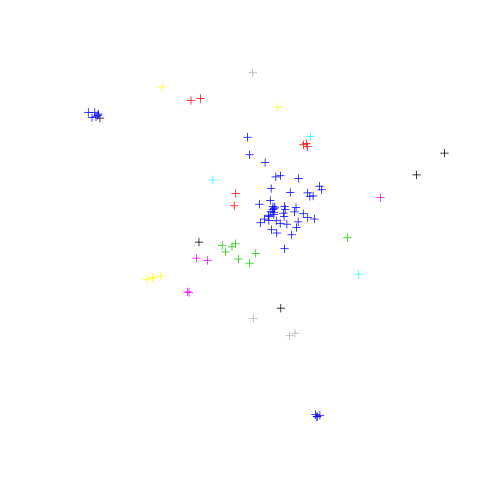 

```r

parquesMadrid <- parquesMadrid[parquesMadrid$MUNICIPIO == "Madrid", ]
plot(parquesMadrid, col = parquesMadrid$MUNICIPIO)
```

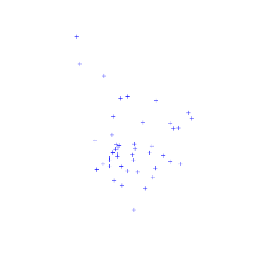 

```r

plot(parquesMadrid, pch = 20, cex = 2, col = "springgreen3")
```

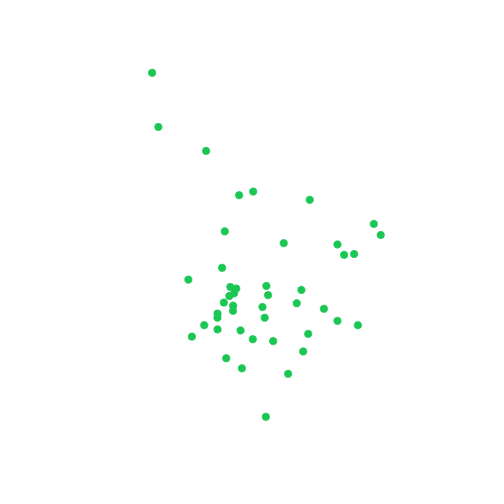 


#### THE NEIGHBORHOODS


```r
getinfo.shape("~/Dropbox/Maps_with_R/Shapefiles/MAD_barrios_madrid/barrios_madrid.shp")  # It is a SpatialPolygonsDataFrame
```

```
## Shapefile type: Polygon, (5), # of Shapes: 128
```

```r
barriosMadrid <- readShapePoly("~/Dropbox/Maps_with_R/Shapefiles/MAD_barrios_madrid/barrios_madrid.shp", 
    proj4string = ED50)
str(barriosMadrid, max.level = 2)
```

```
## Formal class 'SpatialPolygonsDataFrame' [package "sp"] with 5 slots
##   ..@ data       :'data.frame':	128 obs. of  3 variables:
##   .. ..- attr(*, "data_types")= chr [1:3] "N" "C" "C"
##   ..@ polygons   :List of 128
##   .. .. [list output truncated]
##   ..@ plotOrder  : int [1:128] 44 112 114 51 125 52 106 54 127 120 ...
##   ..@ bbox       : num [1:2, 1:2] 424864 4462774 456134 4499579
##   .. ..- attr(*, "dimnames")=List of 2
##   ..@ proj4string:Formal class 'CRS' [package "sp"] with 1 slots
```

```r

head(coordinates(barriosMadrid))
```

```
##     [,1]    [,2]
## 0 439529 4474317
## 1 440497 4473624
## 2 440990 4474246
## 3 441010 4475220
## 4 440129 4475452
## 5 440336 4474520
```

```r
barriosMadrid@bbox
```

```
##       min     max
## x  424864  456134
## y 4462774 4499579
```

```r
head(barriosMadrid@data)
```

```
##   CODBDT GEOCODIGO          DESBDT
## 0 722505    079011     011 Palacio
## 1 722506    079012 012 Embajadores
## 2 722507    079013      013 Cortes
## 3 722508    079014    014 Justicia
## 4 722509    079015 015 Universidad
## 5 722510    079016         016 Sol
```

```r

plot(barriosMadrid)
plot(parquesMadrid, pch = 20, cex = 2, col = "springgreen3", add = TRUE)
```

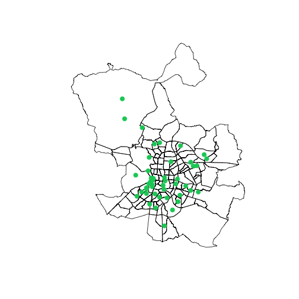 


> Plot some meaningful data   

#### POPULATION DENSITY   
Read the csv file with the Madrid density http://www-2.munimadrid.es/CSE6/control/seleccionDatos?numSerie=14010100010

```r
denMad <- read.csv("Data/denBarriosMad.csv", sep = ";", stringsAsFactors = FALSE)
colnames(denMad) <- c("Barrio", "Densidad")
head(denMad)
```

```
##                   Barrio Densidad
## 1 TOTAL CIUDAD DE MADRID       53
## 2             01. CENTRO      265
## 3           01.1 Palacio      155
## 4       01.2 Embajadores      460
## 5            01.3 Cortes      184
## 6          01.4 Justicia      229
```

```r
# Los barrios tienen una estructura ##.# Barrio (el resto distritos)

denMad <- denMad[which(grepl("[0-9]{2}\\.[0-9]", denMad$Barrio) == TRUE), ]
head(denMad)
```

```
##             Barrio Densidad
## 3     01.1 Palacio      155
## 4 01.2 Embajadores      460
## 5      01.3 Cortes      184
## 6    01.4 Justicia      229
## 7 01.5 Universidad      343
## 8         01.6 Sol      176
```

```r

length(denMad$Barrio)
```

```
## [1] 128
```

```r
length(barriosMadrid$DESBDT)
```

```
## [1] 128
```


Merge the data with the SpatialPolygonDataFrame

```r
head(barriosMadrid@data)
```

```
##   CODBDT GEOCODIGO          DESBDT
## 0 722505    079011     011 Palacio
## 1 722506    079012 012 Embajadores
## 2 722507    079013      013 Cortes
## 3 722508    079014    014 Justicia
## 4 722509    079015 015 Universidad
## 5 722510    079016         016 Sol
```

```r
head(denMad$Barrio)
```

```
## [1] "01.1 Palacio"     "01.2 Embajadores" "01.3 Cortes"     
## [4] "01.4 Justicia"    "01.5 Universidad" "01.6 Sol"
```

```r

# Get ready the Spatial object data to merge
barriosMadrid$DESBDT <- iconv(barriosMadrid$DESBDT, "latin1", "UTF-8")

barriosNamesCodes <- strsplit(sub(" ", "\\.", barriosMadrid$DESBDT), "\\.")
head(barriosNamesCodes)
```

```
## [[1]]
## [1] "011"     "Palacio"
## 
## [[2]]
## [1] "012"         "Embajadores"
## 
## [[3]]
## [1] "013"    "Cortes"
## 
## [[4]]
## [1] "014"      "Justicia"
## 
## [[5]]
## [1] "015"         "Universidad"
## 
## [[6]]
## [1] "016" "Sol"
```

```r

barriosNamesCodes <- do.call(rbind, barriosNamesCodes)
head(barriosNamesCodes)
```

```
##      [,1]  [,2]         
## [1,] "011" "Palacio"    
## [2,] "012" "Embajadores"
## [3,] "013" "Cortes"     
## [4,] "014" "Justicia"   
## [5,] "015" "Universidad"
## [6,] "016" "Sol"
```

```r
barriosMadrid$BarrioCod <- barriosNamesCodes[, 1]
barriosMadrid$Barrio <- barriosNamesCodes[, 2]
head(barriosMadrid@data)
```

```
##   CODBDT GEOCODIGO          DESBDT BarrioCod      Barrio
## 0 722505    079011     011 Palacio       011     Palacio
## 1 722506    079012 012 Embajadores       012 Embajadores
## 2 722507    079013      013 Cortes       013      Cortes
## 3 722508    079014    014 Justicia       014    Justicia
## 4 722509    079015 015 Universidad       015 Universidad
## 5 722510    079016         016 Sol       016         Sol
```

```r


# Get ready the density data.frame to merge
head(denMad)
```

```
##             Barrio Densidad
## 3     01.1 Palacio      155
## 4 01.2 Embajadores      460
## 5      01.3 Cortes      184
## 6    01.4 Justicia      229
## 7 01.5 Universidad      343
## 8         01.6 Sol      176
```

```r
denMad$Barrio <- gsub(".", "", denMad$Barrio, fixed = TRUE)
head(denMad)
```

```
##            Barrio Densidad
## 3     011 Palacio      155
## 4 012 Embajadores      460
## 5      013 Cortes      184
## 6    014 Justicia      229
## 7 015 Universidad      343
## 8         016 Sol      176
```

```r

barriosNamesCodes <- do.call(rbind, strsplit(sub(" ", "\\.", denMad$Barrio), 
    "\\."))
head(barriosNamesCodes)
```

```
##      [,1]  [,2]         
## [1,] "011" "Palacio"    
## [2,] "012" "Embajadores"
## [3,] "013" "Cortes"     
## [4,] "014" "Justicia"   
## [5,] "015" "Universidad"
## [6,] "016" "Sol"
```

```r

denMad$Barrio <- barriosNamesCodes[, 2]
denMad$BarrioCod <- barriosNamesCodes[, 1]
head(denMad)
```

```
##        Barrio Densidad BarrioCod
## 3     Palacio      155       011
## 4 Embajadores      460       012
## 5      Cortes      184       013
## 6    Justicia      229       014
## 7 Universidad      343       015
## 8         Sol      176       016
```

```r
head(barriosMadrid@data)
```

```
##   CODBDT GEOCODIGO          DESBDT BarrioCod      Barrio
## 0 722505    079011     011 Palacio       011     Palacio
## 1 722506    079012 012 Embajadores       012 Embajadores
## 2 722507    079013      013 Cortes       013      Cortes
## 3 722508    079014    014 Justicia       014    Justicia
## 4 722509    079015 015 Universidad       015 Universidad
## 5 722510    079016         016 Sol       016         Sol
```

```r

# Merge the Spatial object data.frame with the density data.frame

identical(sort(barriosMadrid$BarrioCod), sort(denMad$BarrioCod))
```

```
## [1] TRUE
```

```r


barriosMadrid@data <- merge(barriosMadrid@data, denMad[, c(2, 3)])
head(barriosMadrid@data)
```

```
##   BarrioCod CODBDT GEOCODIGO          DESBDT      Barrio Densidad
## 1       011 722505    079011     011 Palacio     Palacio      155
## 2       012 722506    079012 012 Embajadores Embajadores      460
## 3       013 722507    079013      013 Cortes      Cortes      184
## 4       014 722508    079014    014 Justicia    Justicia      229
## 5       015 722509    079015 015 Universidad Universidad      343
## 6       016 722510    079016         016 Sol         Sol      176
```

```r
rm(barriosNamesCodes)
```


#### PLOT THE DATA

```r
plot(barriosMadrid, col = barriosMadrid$Densidad)
```

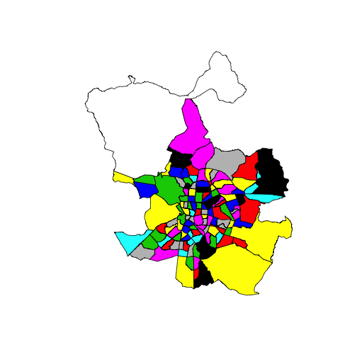 

```r

# SP library
library(RColorBrewer)
colors <- colorRampPalette(brewer.pal(9, "YlGnBu"))(16)
spplot(barriosMadrid, "Densidad", col.regions = colors)
```

 

```r


# Customized colors using the `plot` function

# Cut the variable into breaks and assign a color to every interval.
cut <- cut(barriosMadrid$Densidad, breaks = c(0, 25, 50, 75, 100, 150, 200, 
    250, 300, 350, 500))
barriosMadrid$cut <- cut

colors <- colorRampPalette(brewer.pal(9, "YlGnBu"))(10)
cutColors <- cut(barriosMadrid$Densidad, breaks = c(0, 25, 50, 75, 100, 150, 
    200, 250, 300, 350, 500), labels = colors)
barriosMadrid$colors <- cutColors

head(barriosMadrid@data)
```

```
##   BarrioCod CODBDT GEOCODIGO          DESBDT      Barrio Densidad
## 1       011 722505    079011     011 Palacio     Palacio      155
## 2       012 722506    079012 012 Embajadores Embajadores      460
## 3       013 722507    079013      013 Cortes      Cortes      184
## 4       014 722508    079014    014 Justicia    Justicia      229
## 5       015 722509    079015 015 Universidad Universidad      343
## 6       016 722510    079016         016 Sol         Sol      176
##         cut  colors
## 1 (150,200] #30A5C2
## 2 (350,500] #081D58
## 3 (150,200] #30A5C2
## 4 (200,250] #1E80B8
## 5 (300,350] #21318D
## 6 (150,200] #30A5C2
```

```r

plot(barriosMadrid, col = as.character(barriosMadrid@data$colors))
legend("bottomleft", cex = 0.7, legend = levels(barriosMadrid$cut), fill = colors, 
    title = "Population density Madrid (2013)")
```

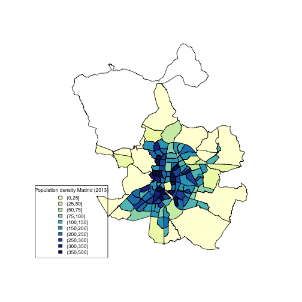 


#### PLOT THE NEIGHBORHOOD LABELS

```r
head(coordinates(barriosMadrid))
```

```
##     [,1]    [,2]
## 0 439529 4474317
## 1 440497 4473624
## 2 440990 4474246
## 3 441010 4475220
## 4 440129 4475452
## 5 440336 4474520
```

```r
length(coordinates(barriosMadrid))
```

```
## [1] 256
```

```r

cents <- coordinates(barriosMadrid)

# pointLabel(cents[ ,1], cents[ ,2], labels=barriosMadrid$Barrio)

# png('labels.png', width = 2500, height = 2100)
plot(barriosMadrid, col = as.character(barriosMadrid@data$colors))
plot(parquesMadrid, pch = 20, cex = 4, col = "springgreen3", add = TRUE)
pointLabel(cents[, 1], cents[, 2], labels = barriosMadrid$Barrio)
legend("bottomleft", cex = 0.9, legend = levels(barriosMadrid$cut), fill = colors, 
    title = "Population density Madrid (2013)")
```

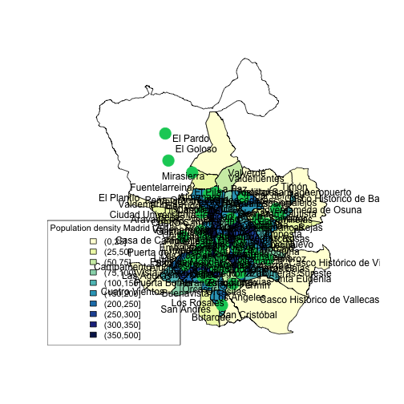 

```r
# dev.off()
```


#### PLOT DENSITY AS POINTS

```r
dots <- dotsInPolys(barriosMadrid, barriosMadrid$Densidad)  # Plot as many dots as people living in every polygon
plot(dots, pch = 16, cex = 0.1, col = "violetred3")
```

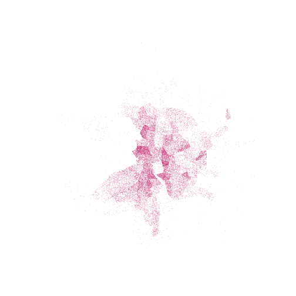 

```r


plot(barriosMadrid, col = "grey90")
plot(dots, pch = 16, cex = 0.1, col = "violetred3", add = TRUE)
plot(parquesMadrid, pch = 20, cex = 1, col = "springgreen3", add = TRUE)
```

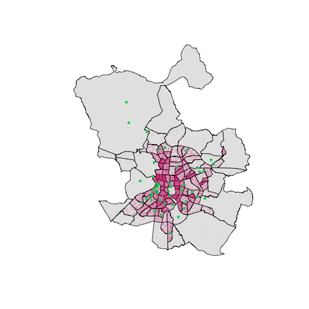 


#### PLOT THE METRO LINES

```r
metroLines <- readShapeLines("~/Dropbox/Maps_with_R/Shapefiles/MAD_lineas_metro/lineas.shp", 
    proj4string = ED50)


plot(barriosMadrid, col = "grey90")
plot(dots, pch = 16, cex = 0.1, col = "violetred3", add = TRUE)
plot(parquesMadrid, pch = 20, cex = 1, col = "springgreen3", add = TRUE)
plot(metroLines, col = "turquoise3", lwd = 2, add = TRUE)
```

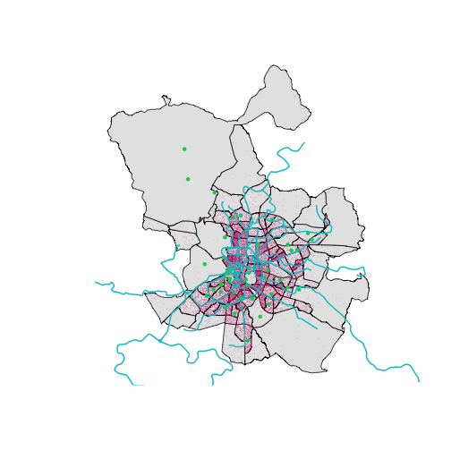 


## 2. Plot a map on a street map. 

### GGMAP AND GGPLOT LIBRARIES (also rgdal and rgeos)

#### 1.CHANGE THE COORDINATE SYSTEM, as we have UTM in our objects and ggplot works on **long, lat** coordinates.      
> For this purpose, the **rgdal** library is needed.   


```r
library(rgdal)

str(barriosMadrid, max.level = 2)
```

```
## Formal class 'SpatialPolygonsDataFrame' [package "sp"] with 5 slots
##   ..@ data       :'data.frame':	128 obs. of  8 variables:
##   ..@ polygons   :List of 128
##   .. .. [list output truncated]
##   ..@ plotOrder  : int [1:128] 44 112 114 51 125 52 106 54 127 120 ...
##   ..@ bbox       : num [1:2, 1:2] 424864 4462774 456134 4499579
##   .. ..- attr(*, "dimnames")=List of 2
##   ..@ proj4string:Formal class 'CRS' [package "sp"] with 1 slots
```

```r
barriosMadrid@proj4string
```

```
## CRS arguments:
##  +proj=utm +zone=30 +ellps=intl +units=m +no_defs
```

```r


barriosLongLat <- spTransform(barriosMadrid, CRS("+proj=longlat"))  # Transform the coordinates to lon lat
parquesLongLat <- spTransform(parquesMadrid, CRS("+proj=longlat"))
metroLongLat <- spTransform(metroLines, CRS("+proj=longlat"))  # we need to have told to R already qich were the original projection
```


#### 2.Create a data.frame from the Spatial**DataFrame data slot, containing the long and lat variables, as ggplot plots data.frames and not Spatial objects


```r
library(ggplot2)

# Points DataFrame to ggplot
head(coordinates(parquesLongLat))
```

```
##    coords.x1 coords.x2
## 24    -3.616     40.40
## 25    -3.699     40.48
## 26    -3.710     40.48
## 27    -3.598     40.46
## 28    -3.682     40.39
## 29    -3.655     40.40
```

```r

long <- coordinates(parquesLongLat)[, 1]
lat <- coordinates(parquesLongLat)[, 2]
dataParques <- cbind(parquesLongLat@data, long, lat)
head(dataParques)
```

```
##    CODIGO2 CMUN MUNICIPIO                                     ETIQUETA
## 24      25  079    Madrid Parque Forestal de Valdebernardo (Vicálvaro)
## 25      26  079    Madrid                                 Parque Norte
## 26      27  079    Madrid                         Parque de la Vaguada
## 27      28  079    Madrid        Parque El Capricho (Alameda de Osuna)
## 28      29  079    Madrid        Parque Enrique Tierno Galván (Madrid)
## 29      30  079    Madrid                     Parque Cerro del Tío Pío
##                                                                BUSCA
## 24 Parque Forestal de Valdebernardo (Vicálvaro) (Parques y Jardines)
## 25                                 Parque Norte (Parques y Jardines)
## 26                         Parque de la Vaguada (Parques y Jardines)
## 27        Parque El Capricho (Alameda de Osuna) (Parques y Jardines)
## 28        Parque Enrique Tierno Galván (Madrid) (Parques y Jardines)
## 29                     Parque Cerro del Tío Pío (Parques y Jardines)
##                                              DIRECCION  UTM_X   UTM_Y
## 24                                Avda. Democracia, 29 447759 4472738
## 25                       Avda. Monforte de Lemos , s/n 440788 4481637
## 26                         Avda. Monforte de Lemos, 42 439851 4481396
## 27                               Avda. de Logroño, s/n 449277 4478747
## 28                          Avda. del Planetario , s/n 442119 4471681
## 29 Barrio de Vallecas cerca de la Avda. de la Albufera 444451 4472164
##                                                                              INFOR
## 24            Parque Forestal de Valdebernardo (Vicálvaro)<br>Avda. Democracia, 29
## 25                                   Parque Norte<br>Avda. Monforte de Lemos , s/n
## 26                             Parque de la Vaguada<br>Avda. Monforte de Lemos, 42
## 27                  Parque El Capricho (Alameda de Osuna)<br>Avda. de Logroño, s/n
## 28             Parque Enrique Tierno Galván (Madrid)<br>Avda. del Planetario , s/n
## 29 Parque Cerro del Tío Pío<br>Barrio de Vallecas cerca de la Avda. de la Albufera
##      long   lat
## 24 -3.616 40.40
## 25 -3.699 40.48
## 26 -3.710 40.48
## 27 -3.598 40.46
## 28 -3.682 40.39
## 29 -3.655 40.40
```

```r

ggplot(dataParques, aes(long, lat)) + geom_point(colour = "springgreen3", size = 4)
```

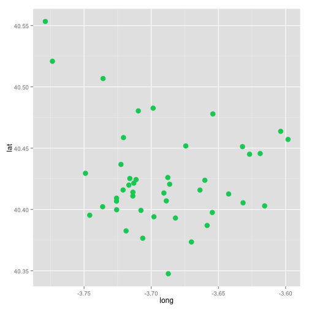 

```r


# Polygons DataFrame to ggplot
head(coordinates(barriosLongLat))
```

```
##     [,1]  [,2]
## 0 -3.713 40.42
## 1 -3.701 40.41
## 2 -3.696 40.42
## 3 -3.695 40.42
## 4 -3.706 40.43
## 5 -3.703 40.42
```

```r
barriosLongLat@data$id <- rownames(barriosLongLat@data)
dataBarrios <- fortify(barriosLongLat, region = "id")  # requires rgeos package. explicitly identifies attribute rows by the .dbf offset.
head(dataBarrios)
```

```
##     long   lat order  hole piece group id
## 1 -3.708 40.42     1 FALSE     1   1.1  1
## 2 -3.708 40.42     2 FALSE     1   1.1  1
## 3 -3.708 40.42     3 FALSE     1   1.1  1
## 4 -3.708 40.42     4 FALSE     1   1.1  1
## 5 -3.708 40.42     5 FALSE     1   1.1  1
## 6 -3.708 40.42     6 FALSE     1   1.1  1
```

```r
class(dataBarrios)
```

```
## [1] "data.frame"
```

```r
dataBarrios <- merge(dataBarrios, barriosLongLat@data)
head(dataBarrios)
```

```
##   id   long   lat order  hole piece group BarrioCod CODBDT GEOCODIGO
## 1  1 -3.708 40.42     1 FALSE     1   1.1       011 722505    079011
## 2  1 -3.708 40.42     2 FALSE     1   1.1       011 722505    079011
## 3  1 -3.708 40.42     3 FALSE     1   1.1       011 722505    079011
## 4  1 -3.708 40.42     4 FALSE     1   1.1       011 722505    079011
## 5  1 -3.708 40.42     5 FALSE     1   1.1       011 722505    079011
## 6  1 -3.708 40.42     6 FALSE     1   1.1       011 722505    079011
##        DESBDT  Barrio Densidad       cut  colors
## 1 011 Palacio Palacio      155 (150,200] #30A5C2
## 2 011 Palacio Palacio      155 (150,200] #30A5C2
## 3 011 Palacio Palacio      155 (150,200] #30A5C2
## 4 011 Palacio Palacio      155 (150,200] #30A5C2
## 5 011 Palacio Palacio      155 (150,200] #30A5C2
## 6 011 Palacio Palacio      155 (150,200] #30A5C2
```

```r


# Lines DataFrame to ggplot
str(coordinates(metroLongLat@lines[[1]]))
```

```
## List of 1
##  $ : num [1:168, 1:2] -3.77 -3.77 -3.77 -3.77 -3.77 ...
```

```r
length(metroLongLat@lines)
```

```
## [1] 73
```

```r
head(coordinates(metroLongLat@lines[[1]]))
```

```
## [[1]]
##          [,1]  [,2]
##   [1,] -3.766 40.25
##   [2,] -3.766 40.25
##   [3,] -3.766 40.25
##   [4,] -3.766 40.25
##   [5,] -3.767 40.25
##   [6,] -3.767 40.24
##   [7,] -3.768 40.24
##   [8,] -3.768 40.24
##   [9,] -3.768 40.24
##  [10,] -3.769 40.24
##  [11,] -3.769 40.24
##  [12,] -3.769 40.24
##  [13,] -3.769 40.24
##  [14,] -3.769 40.24
##  [15,] -3.769 40.24
##  [16,] -3.770 40.24
##  [17,] -3.770 40.24
##  [18,] -3.770 40.24
##  [19,] -3.771 40.24
##  [20,] -3.772 40.24
##  [21,] -3.771 40.24
##  [22,] -3.771 40.23
##  [23,] -3.770 40.23
##  [24,] -3.770 40.23
##  [25,] -3.770 40.23
##  [26,] -3.769 40.23
##  [27,] -3.769 40.23
##  [28,] -3.769 40.23
##  [29,] -3.769 40.23
##  [30,] -3.768 40.23
##  [31,] -3.768 40.23
##  [32,] -3.765 40.23
##  [33,] -3.763 40.23
##  [34,] -3.761 40.23
##  [35,] -3.761 40.23
##  [36,] -3.761 40.23
##  [37,] -3.761 40.23
##  [38,] -3.760 40.23
##  [39,] -3.760 40.23
##  [40,] -3.760 40.23
##  [41,] -3.760 40.23
##  [42,] -3.759 40.23
##  [43,] -3.759 40.23
##  [44,] -3.759 40.23
##  [45,] -3.759 40.23
##  [46,] -3.759 40.23
##  [47,] -3.759 40.23
##  [48,] -3.759 40.23
##  [49,] -3.760 40.22
##  [50,] -3.756 40.22
##  [51,] -3.755 40.22
##  [52,] -3.755 40.23
##  [53,] -3.754 40.23
##  [54,] -3.754 40.23
##  [55,] -3.753 40.23
##  [56,] -3.751 40.24
##  [57,] -3.751 40.24
##  [58,] -3.751 40.24
##  [59,] -3.751 40.24
##  [60,] -3.750 40.24
##  [61,] -3.750 40.24
##  [62,] -3.750 40.24
##  [63,] -3.749 40.24
##  [64,] -3.750 40.24
##  [65,] -3.749 40.24
##  [66,] -3.749 40.24
##  [67,] -3.748 40.24
##  [68,] -3.748 40.24
##  [69,] -3.748 40.24
##  [70,] -3.748 40.24
##  [71,] -3.748 40.24
##  [72,] -3.747 40.24
##  [73,] -3.747 40.24
##  [74,] -3.748 40.24
##  [75,] -3.748 40.24
##  [76,] -3.748 40.24
##  [77,] -3.748 40.24
##  [78,] -3.749 40.24
##  [79,] -3.750 40.24
##  [80,] -3.751 40.24
##  [81,] -3.752 40.24
##  [82,] -3.752 40.24
##  [83,] -3.754 40.25
##  [84,] -3.754 40.25
##  [85,] -3.755 40.25
##  [86,] -3.755 40.25
##  [87,] -3.755 40.25
##  [88,] -3.755 40.25
##  [89,] -3.755 40.25
##  [90,] -3.756 40.25
##  [91,] -3.756 40.25
##  [92,] -3.756 40.25
##  [93,] -3.756 40.25
##  [94,] -3.756 40.25
##  [95,] -3.756 40.25
##  [96,] -3.756 40.25
##  [97,] -3.756 40.25
##  [98,] -3.757 40.25
##  [99,] -3.757 40.25
## [100,] -3.757 40.25
## [101,] -3.757 40.25
## [102,] -3.757 40.25
## [103,] -3.757 40.25
## [104,] -3.757 40.25
## [105,] -3.758 40.25
## [106,] -3.760 40.25
## [107,] -3.761 40.25
## [108,] -3.761 40.25
## [109,] -3.761 40.25
## [110,] -3.762 40.25
## [111,] -3.762 40.25
## [112,] -3.762 40.25
## [113,] -3.762 40.25
## [114,] -3.762 40.25
## [115,] -3.763 40.25
## [116,] -3.763 40.25
## [117,] -3.763 40.25
## [118,] -3.763 40.25
## [119,] -3.763 40.25
## [120,] -3.763 40.25
## [121,] -3.763 40.25
## [122,] -3.763 40.25
## [123,] -3.763 40.25
## [124,] -3.763 40.25
## [125,] -3.763 40.25
## [126,] -3.763 40.25
## [127,] -3.763 40.25
## [128,] -3.763 40.25
## [129,] -3.763 40.25
## [130,] -3.764 40.25
## [131,] -3.764 40.25
## [132,] -3.764 40.25
## [133,] -3.764 40.25
## [134,] -3.764 40.25
## [135,] -3.764 40.25
## [136,] -3.764 40.25
## [137,] -3.764 40.25
## [138,] -3.764 40.25
## [139,] -3.764 40.25
## [140,] -3.764 40.25
## [141,] -3.764 40.25
## [142,] -3.764 40.25
## [143,] -3.764 40.25
## [144,] -3.764 40.25
## [145,] -3.764 40.25
## [146,] -3.764 40.25
## [147,] -3.764 40.25
## [148,] -3.764 40.25
## [149,] -3.764 40.25
## [150,] -3.764 40.25
## [151,] -3.764 40.25
## [152,] -3.764 40.25
## [153,] -3.764 40.25
## [154,] -3.765 40.25
## [155,] -3.765 40.25
## [156,] -3.765 40.25
## [157,] -3.765 40.25
## [158,] -3.765 40.25
## [159,] -3.765 40.25
## [160,] -3.765 40.25
## [161,] -3.765 40.25
## [162,] -3.765 40.25
## [163,] -3.765 40.25
## [164,] -3.766 40.25
## [165,] -3.766 40.25
## [166,] -3.766 40.25
## [167,] -3.766 40.25
## [168,] -3.766 40.25
```

```r


metroLongLat@data$id <- rownames(metroLongLat@data)
dataMetro <- fortify(metroLongLat, region = "id")  # requires rgeos package
head(dataMetro)
```

```
##     long   lat order piece group id
## 1 -3.766 40.25     1     1   0.1  0
## 2 -3.766 40.25     2     1   0.1  0
## 3 -3.766 40.25     3     1   0.1  0
## 4 -3.766 40.25     4     1   0.1  0
## 5 -3.767 40.25     5     1   0.1  0
## 6 -3.767 40.24     6     1   0.1  0
```

```r
class(dataMetro)
```

```
## [1] "data.frame"
```

```r
dataMetro <- merge(dataMetro, metroLongLat@data)
head(dataMetro)
```

```
##   id   long   lat order piece group ETIQUETA
## 1  0 -3.766 40.25     1     1   0.1       TP
## 2  0 -3.766 40.25     2     1   0.1       TP
## 3  0 -3.766 40.25     3     1   0.1       TP
## 4  0 -3.766 40.25     4     1   0.1       TP
## 5  0 -3.767 40.25     5     1   0.1       TP
## 6  0 -3.767 40.24     6     1   0.1       TP
```


#### 3.Once we have data.frames ready plot them on a streetmap

```r
library(ggmap)
MadridMap <- qmap(location = "Museo del Prado", zoom = 15, source = "google")
MadridMap
```

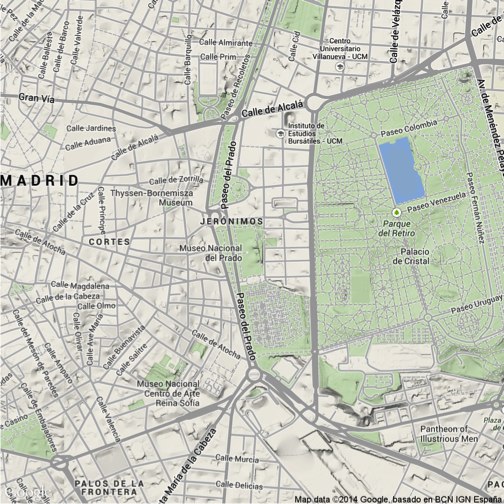 

```r

MadridMap <- qmap(location = barriosLongLat@bbox, zoom = 11, maptype = "terrain")  # Get the map from Google maps
MadridMap
```

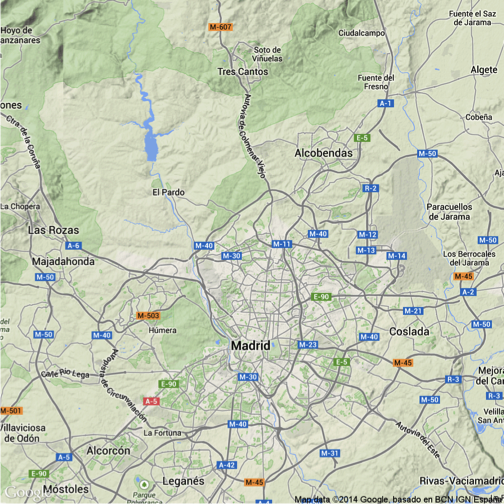 

```r


MadridMap + geom_polygon(aes(x = long, y = lat, group = group, fill = Densidad), 
    data = dataBarrios, alpha = 0.5, colour = "white") + scale_fill_gradient(low = "grey90", 
    high = "black", limits = c(0, 500)) + geom_path(aes(x = long, y = lat, group = group), 
    data = dataMetro, colour = "turquoise3") + geom_point(aes(x = long, y = lat), 
    data = dataParques, , size = 5, alpha = 0.8, colour = "springgreen3") + 
    theme(legend.position = "none")
```

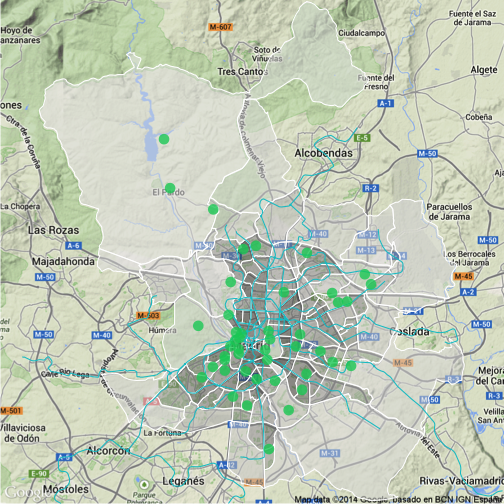 


## 3. Plot a map with ggplot without a background street map. 

```r
ggplot() + geom_polygon(aes(x = long, y = lat, group = group, fill = Densidad), 
    data = dataBarrios) + scale_fill_gradient(low = "grey90", high = "black", 
    limits = c(0, 500)) + geom_point(aes(x = long, y = lat, size = 5), data = dataParques, 
    colour = "springgreen3") + geom_path(aes(x = long, y = lat, group = group), 
    data = dataMetro, colour = "turquoise3") + theme(legend.position = "none", 
    panel.background = element_blank(), panel.grid = element_blank(), axis.ticks = element_blank(), 
    text = element_blank())
```

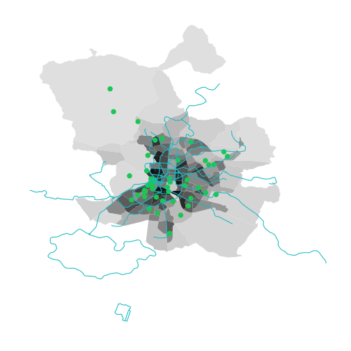 


## 4. googleVis

```r
library(googleVis)
emigrantes <- read.csv("Data/emigrantes.csv", sep = ";")
head(emigrantes)
```

```
##     X                pais  X2008  X2009  X2010  X2011  X2012
## 1 131    PAIS DESCONOCIDO  52069  94850 134790 138972 146309
## 2 132 BAJAS POR CADUCIDAD 142315 154213 163515 139223 130421
## 3  82             AMERICA  26993  29440  29319  36618  43667
## 4  92             Ecuador   1693   3027   4292   6668  10622
## 5  29         Reino Unido   5186   5339   6249   8237   8055
## 6  17             Francia   4394   4338   5105   6130   6960
```

```r

## me quedo las que no empiezan por dos mayúsculas
emigrantes <- emigrantes[which(grepl("^[A-Z]{2}", emigrantes$pais) == FALSE), 
    ]
head(emigrantes)
```

```
##     X           pais X2008 X2009 X2010 X2011 X2012
## 4  92        Ecuador  1693  3027  4292  6668 10622
## 5  29    Reino Unido  5186  5339  6249  8237  8055
## 6  17        Francia  4394  4338  5105  6130  6960
## 7   8       Alemania  3991  4123  4658  5904  6577
## 10 32        Rumanía  5854  5673  4875  5076  5359
## 11 94 Estados Unidos  4163  3897  3647  4891  4498
```

```r

emigrantesMap <- gvisGeoChart(emigrantes, locationvar = "pais", colorvar = "X2012", 
    options = list(width = 800, height = 500))

plot(emigrantesMap)

cat(emigrantesMap$html$chart, file = "emigrantes2012.html")
```

